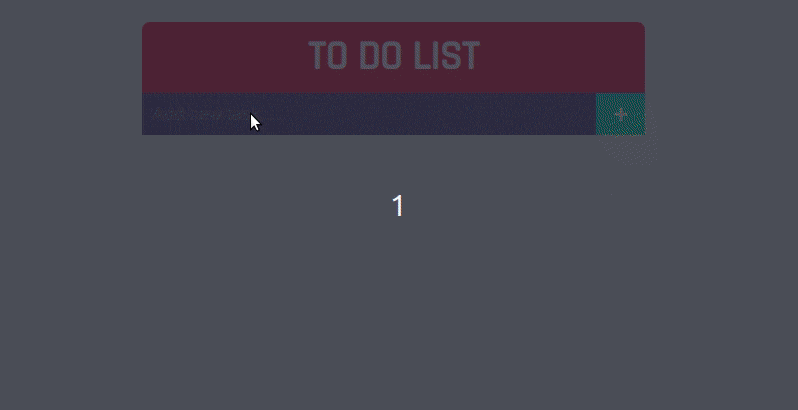

# To Do List
# Live-Demo (https://harshi0102.github.io/todolistpractice/)

 I have a working to-do list app. It is very simple to use and it is very easy to add new tasks.

You can add, edit, remove and mark tasks as completed. You can also save your tasks to local storage and load them when you open the app again.

